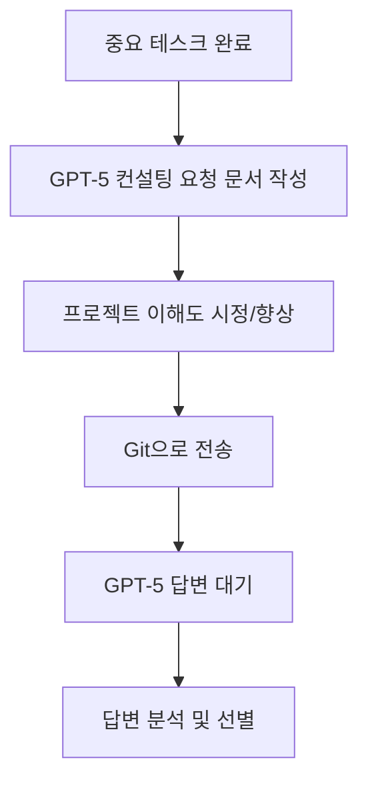
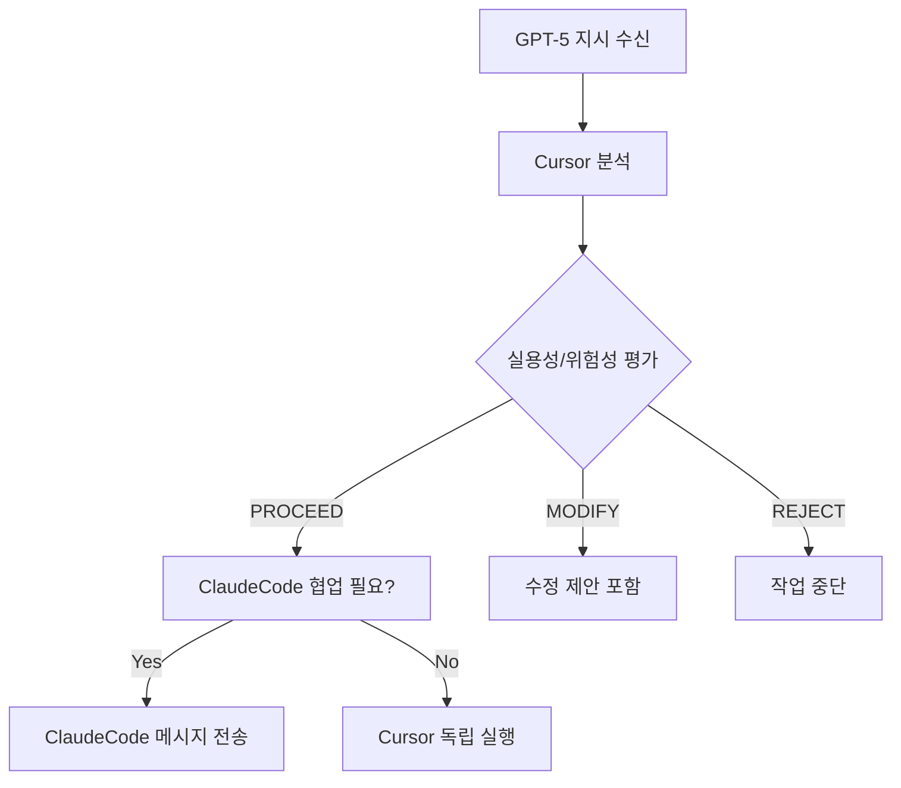
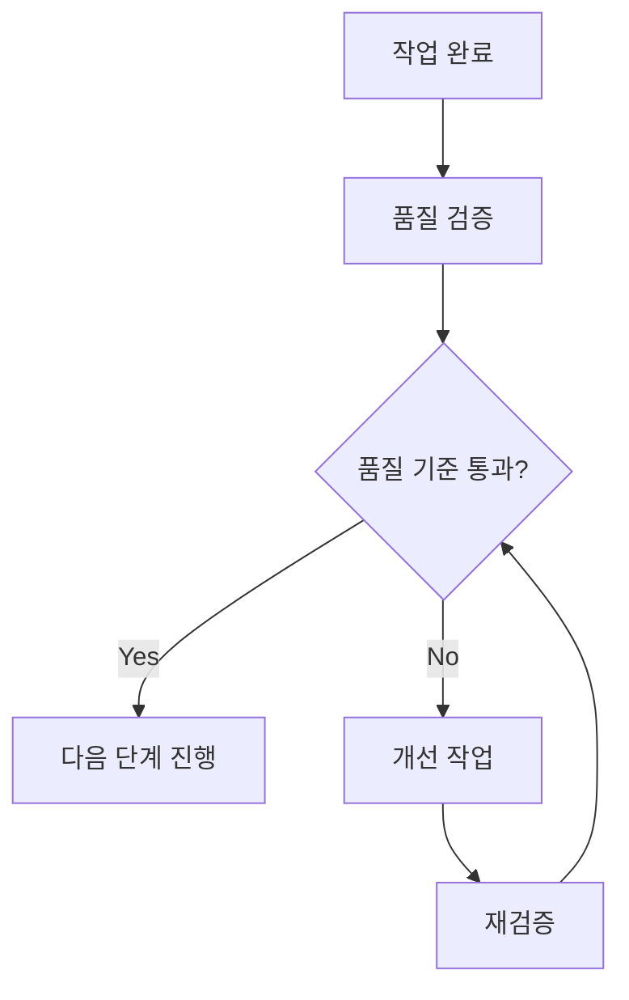

# 🚀 Snap3 VDP Platform - 3단계 협업 시스템 규칙

## 🎯 **핵심 협업 아키텍처**

### **3단계 계층 구조**
```
GPT-5 Pro CTO (전략/컨설팅)
    ↓
Cursor (실행 총괄/분배)
    ↓
ClaudeCode (전문 구현)
```

---

## 🏗️ **역할 분담 체계**

### **GPT-5 Pro CTO (전략 컨설턴트)**
- **역할**: 고수준 전략 수립, 아키텍처 검토, 기술적 의사결정 지원
- **입력**: 프로젝트 상황 분석, 문제 진단, 해결책 제시
- **제약**: 원격 컨설팅 (파일 직접 접근 불가), 할루시네이션 가능성
- **출력**: 전략 문서, 아키텍처 가이드, 기술적 권장사항

### **Cursor (실행 총괄)**
- **역할**: GPT-5 지시 해석, 작업 분배, 품질 관리, 최종 통합
- **책임**: 
  - GPT-5 지시의 실용성/위험성 분석
  - ClaudeCode와의 협업 조율
  - 프로젝트 전체 비전 유지
  - GPT-5 프로젝트 이해도 향상
- **권한**: 작업 분배 결정, 우선순위 설정, 품질 게이트 관리

### **ClaudeCode (전문 구현)**
- **역할**: 구체적 코드 구현, 기술적 세부사항 처리
- **전문분야**: 서버 구현, API 개발, 시스템 통합
- **책임**: 코드 품질, 성능 최적화, 버그 수정

---

## 🔄 **작업 플로우**

### **1. GPT-5 컨설팅 요청 단계**


### **2. 작업 분배 단계**


### **3. 품질 관리 단계**


---

## 📝 **커뮤니케이션 프로토콜**

### **GPT-5 컨설팅 요청 문서 형식**
```markdown
# GPT-5 Pro CTO 컨설팅 요청

## 📊 현재 상황
- 완료된 작업 요약
- 달성된 목표
- 현재 직면한 문제

## 🎯 컨설팅 요청사항
- 구체적 질문/요청사항
- 기술적 의사결정 필요사항
- 아키텍처 검토 요청

## 🔧 프로젝트 이해도 시정
- GPT-5의 잘못된 이해 시정
- 현재 아키텍처 설명
- 제약사항 명시

## 📈 다음 단계 로드맵
- 제안하는 다음 단계
- 예상 소요 시간
- 성공 기준
```

### **ClaudeCode 협업 메시지 형식**
```markdown
# ClaudeCode 협업 요청

## 🎯 작업 개요
- GPT-5 지시사항 요약
- Cursor 분석 결과
- 우선순위 및 마감일

## 🔧 기술적 요구사항
- 구체적 구현 사항
- 코드 변경 범위
- 테스트 요구사항

## 📋 성공 기준
- 완료 조건
- 품질 기준
- 검증 방법

## ⚠️ 주의사항
- 위험 요소
- 제약사항
- 대안 방안
```

---

## 🎯 **품질 관리 기준**

### **GPT-5 지시 선별 기준**
- **실용성**: 구현 가능성, 시간 효율성, 기술적 합리성
- **위험성**: 시스템 안정성, 복잡도 증가, 유지보수성
- **우선순위**: 비즈니스 가치, UX 개선, 기술 부채 감소

### **작업 분배 기준**
- **Cursor 독립 실행**: 문서화, UI/UX, 프론트엔드 로직, 코드 정리
- **ClaudeCode 협업**: API 통합, 시스템 아키텍처, DB 스키마, 서버 설정
- **양측 협업**: 복잡한 통합 작업, 크로스 플랫폼 기능

### **품질 게이트**
- **코드 품질**: TypeScript 타입 안전성, 에러 처리, 로깅
- **성능**: 응답 시간, 메모리 사용량, 처리량
- **안정성**: 에러율, 복구 능력, 모니터링
- **사용자 경험**: 응답성, 접근성, 직관성

---

## 📊 **모니터링 및 개선**

### **성과 지표**
- **작업 완료율**: 계획 대비 완료율
- **품질 통과율**: 품질 게이트 통과율
- **협업 효율성**: 메시지 전달 성공율, 응답 시간
- **GPT-5 이해도**: 프로젝트 정확성 향상율

### **개선 프로세스**
- **정기 리뷰**: 주간 협업 효율성 검토
- **피드백 수집**: 각 단계별 개선점 수집
- **프로세스 최적화**: 비효율적 단계 개선
- **도구 개선**: 협업 도구 및 프로세스 업그레이드

---

## 🚨 **위험 관리**

### **GPT-5 할루시네이션 대응**
- **검증 의무**: 모든 GPT-5 제안의 실용성 검증
- **단계적 적용**: 큰 변경사항의 점진적 적용
- **롤백 계획**: 문제 발생 시 즉시 복구 방안

### **협업 실패 대응**
- **통신 중단**: 파일 기반 백업 전달 시스템
- **품질 저하**: 즉시 개선 작업 시작
- **일정 지연**: 우선순위 재조정 및 리소스 재배치

---

## 📚 **참고 문서**

### **핵심 문서**
- `CLAUDE.md` - 프로젝트 기본 설정 및 아키텍처
- `OPERATIONAL_RULES.md` - 운영 규칙 및 정책
- `QUALITY_GATES_COMPLETE.md` - 품질 게이트 구현
- `PRODUCTION_READY.md` - 프로덕션 준비 상태

### **협업 문서**
- `.collab-msg-*` - 협업 메시지 파일들
- `HEAD_SUMMARY.md` - 최신 프로젝트 상태
- `CURSOR_CONTEXT.md` - Cursor 컨텍스트 정보

---

## 🎯 **성공 기준**

### **단기 목표 (1주)**
- ✅ 3단계 협업 체제 안정화
- ✅ GPT-5 컨설팅 요청 프로세스 정립
- ✅ ClaudeCode 협업 효율성 향상

### **중기 목표 (1개월)**
- ✅ IG/TikTok 자동화율 90%+ 달성
- ✅ 전체 시스템 안정성 99%+ 달성
- ✅ GPT-5 프로젝트 이해도 95%+ 달성

### **장기 목표 (3개월)**
- ✅ 완전 자동화된 VDP 파이프라인
- ✅ 다중 플랫폼 지원 확장
- ✅ 엔터프라이즈급 안정성 달성

---

**이 규칙을 따르면 Snap3 VDP 플랫폼의 모든 기능을 최적의 효율성으로 구현할 수 있습니다! 🚀**
