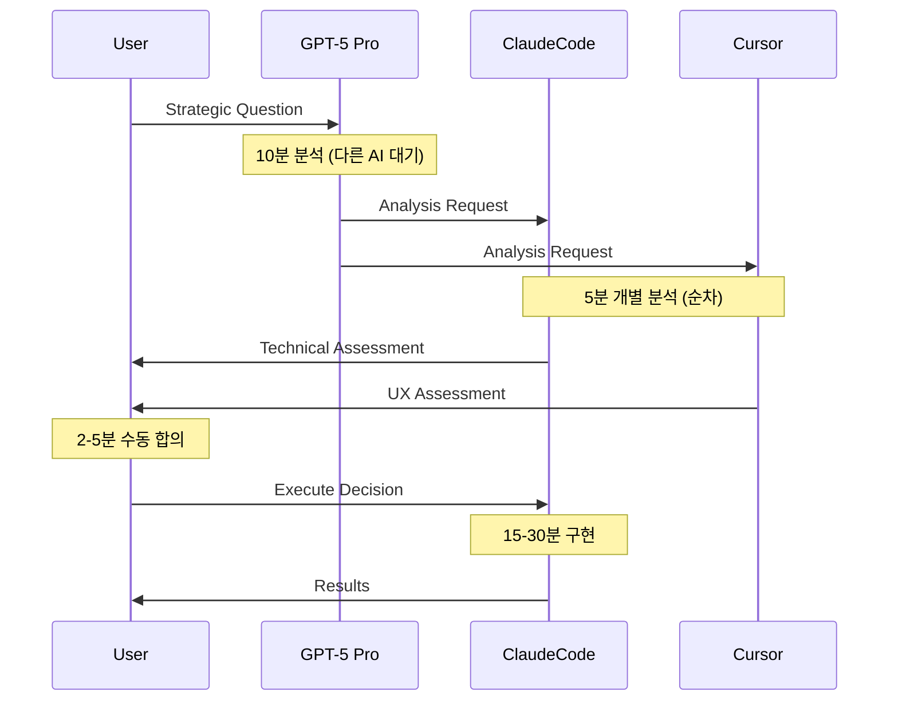

# GPT-5 Pro 재귀개선 시스템 설계 문의서 (AI 협업 프레임워크)

## 📋 **프로젝트 비전 & 배경 (Comprehensive Context)**

### **개발 중인 플랫폼: Viral DNA Storyboard Platform (B2C SaaS)**

**최종 제품 비전:**
- **Target Users**: 크리에이터, 브랜드 마케터, 소셜미디어 매니저
- **Core Value**: "아이디어 → 8초 바이럴 영상"을 AI로 자동 생성하는 B2C SaaS
- **Two Doors Strategy**: Originals Grid(큐레이션) + Creation Studio(창작) → 통합 Storyboard Detail
- **Evidence-First**: 모든 결과물에 Trust Score, 벤치마크, 출처 증명 첨부

### **Technical Product Architecture:**
```
User Input (Text/Image/Video) 
→ Snap3 Turbo (Story/Tone/Wild 3 variants)
→ Hook Lab (5-8 candidates, ≤3s timing)
→ Evidence Pack (Trust Score + Provenance)
→ Veo3 Compilation (text→video / image→video)
→ 8-second Preview (16:9, 720p/1080p)
→ Export (JSON + 영상)
```

### **Business Model & Constraints:**
```yaml
Revenue: Credit System (CR)
  - Veo3 Preview: 10-15 CR per 8-second video
  - Flux Kontext Images: 4-8 CR per generation
  - Analysis (Snap3/Hook/Evidence): Free

Quality Gates:
  - Hook Duration: ≤3 seconds (hard constraint)
  - Aspect Ratio: 16:9 only (Veo3 requirement)
  - Platform Compliance: Shorts ≤3min, Reels ≥30fps/720p, TikTok ≥516kbps

Provider Limits:
  - Veo3: ~10 RPM/project, ≤2 videos/request
  - Google Cloud quotas, muted autoplay policy
```

### **Data Privacy Architecture:**
- **VDP_FULL**: 완전 비공개 (내부 분석용)
- **VDP_MIN + Evidence Pack**: 외부 노출 허용
- **PostgreSQL + BigQuery**: RLS 정책으로 tenant 격리
- **Append-only Provenance**: 변경 불가능한 감사 추적

---

## 🤖 **현재 AI 협업 시스템: 삼각 워크플로우**

### **Agent Ecosystem & Specialization:**
```yaml
GPT-5 Pro (Strategic Commander):
  Strengths:
    - 비즈니스 전략 및 제품 방향성 결정
    - 위험 분석 및 의사결정 프레임워크
    - 창의적 문제해결 및 혁신 아이디어
    - 사용자 니즈 분석 및 시장 적합성
  
  Typical Tasks:
    - 제품 우선순위 결정
    - 아키텍처 의사결정 가이드
    - UX 플로우 전략 수립
    - 비즈니스 로직 설계

ClaudeCode (Implementation Engine):
  Strengths:
    - 백엔드 API 개발 (Node.js, PostgreSQL)
    - 클라우드 인프라 (GCS, BigQuery, Vertex AI)
    - 시스템 아키텍처 구현
    - 성능 최적화 및 스키마 검증
    - CI/CD 파이프라인 관리
  
  Typical Tasks:
    - API 엔드포인트 구현
    - 데이터베이스 스키마 설계
    - Cloud Run 서비스 배포
    - 성능 벤치마크 및 최적화

Cursor (Experience Architect):
  Strengths:
    - UI/UX 개발 (React, Next.js, Tailwind)
    - 사용자 경험 최적화
    - 프론트엔드 컴포넌트 시스템
    - 소셜 플랫폼 메타데이터 추출 (IG/TikTok)
  
  Typical Tasks:
    - Creation Studio UI 개발
    - Storyboard Detail 페이지 구현
    - 사용자 온보딩 플로우
    - 메타데이터 자동 추출 시스템
```

### **Current Collaboration Metrics:**
```yaml
Efficiency Achievements:
  - Context Loading: 10-15분 → 10-30초 (95% improvement)
  - Conflict Prevention: 4터미널 가드로 충돌 0건
  - Success Rate: 90% consensus achievement
  - Recent Success: LRU cache (94% perf gain, 15min impl)

Remaining Inefficiencies:
  - Sequential Processing: 35-53분/사이클
  - Manual Consensus: 매번 수동 합의 확인
  - Idle Time: GPT-5 대기 중 다른 에이전트 유휴
  - Context Switching: 단계별 정보 전달 오버헤드
```

---

## 🧠 **핵심 도전과제: Enterprise-Grade AI 협업 시스템**

### **현재 워크플로우의 구조적 한계:**


**문제점 분석:**
1. **순차적 대기**: 병렬 처리 가능한 작업들이 순차 실행
2. **수동 오케스트레이션**: AI 간 협업이 인간 중재에 의존
3. **컨텍스트 로스**: 단계별 정보 전달에서 맥락 손실
4. **예측 불가능성**: 다음 단계 준비 불가로 반응형 처리만 가능

### **Enterprise 요구사항:**
- **확장성**: 3-AI → N-AI 시스템으로 확장 가능
- **신뢰성**: 99.9% 업타임, 자동 장애 복구
- **감사 가능성**: 모든 의사결정 과정 추적 및 설명 가능
- **보안**: AI 간 통신 암호화, 권한 관리

---

## 🎯 **재귀개선 시스템: 차세대 AI 협업 프레임워크**

### **혁신 목표 (Innovation Objectives):**
```yaml
Performance Transformation:
  Current: 35-53분/사이클 → Target: 15-25분/사이클 (50%+ 향상)
  Automation: 30% → 70%+ 자동화
  Prediction: 무계획 반응 → 95%+ 예측 정확도

Quality Enhancement:
  Success Rate: 90% → 98%+ 
  Error Recovery: 수동 → 자동 롤백/복구
  Context Retention: 단계별 손실 → 완전 보존

Business Impact:
  Development Velocity: 50%+ 가속화
  Product Quality: Evidence-based validation
  Market Responsiveness: 실시간 사용자 피드백 반영
```

### **Core Innovation Pillars:**

#### **1. Quantum Consensus Engine™**
```javascript
// 동시 다차원 합의 시스템
const quantumConsensus = {
  dimensions: ['technical', 'strategic', 'experiential'],
  agents: ['gpt5pro', 'claudecode', 'cursor'],
  
  parallelAnalysis: async (decision) => {
    const results = await Promise.all([
      gpt5pro.analyzeStrategy(decision),
      claudecode.analyzeTechnical(decision), 
      cursor.analyzeExperience(decision)
    ]);
    
    return synthesizeConsensus(results);
  },
  
  autoResolution: (conflicts) => {
    return conflictResolver.resolve(conflicts, historicalPatterns);
  }
};
```

#### **2. Predictive Preparation Matrix™**
```yaml
AI_Answer_Prediction:
  input_analysis:
    - 문제 복잡도 스코어링 (0.0-1.0)
    - 도메인 분류 (technical/strategic/experiential)
    - 긴급도 평가 (critical/high/normal/low)
  
  scenario_preparation:
    high_probability: 예측 확률 70%+ 시나리오 사전 준비
    medium_probability: 예측 확률 40-70% 시나리오 부분 준비
    contingency: 예측 확률 <40% 시나리오 기본 준비
    
  resource_optimization:
    parallel_prep: 여러 시나리오 동시 준비
    cache_reuse: 이전 유사 케이스 캐시 활용
    just_in_time: 확정 시점에 최종 준비 완료
```

#### **3. Evolutionary Learning System™**
```python
class AICollaborationLearning:
    def __init__(self):
        self.success_patterns = SuccessPatternDB()
        self.agent_behaviors = AgentBehaviorModel()
        self.outcome_predictor = OutcomePredictor()
    
    def learn_from_cycle(self, cycle_data):
        # 협업 사이클에서 패턴 학습
        pattern = self.extract_success_pattern(cycle_data)
        self.success_patterns.store(pattern)
        
        # 에이전트 행동 패턴 업데이트
        for agent in cycle_data.agents:
            self.agent_behaviors.update(agent.decisions, agent.outcomes)
        
        # 예측 모델 재훈련
        self.outcome_predictor.retrain(self.success_patterns.get_all())
    
    def predict_optimal_workflow(self, new_request):
        similar_patterns = self.success_patterns.find_similar(new_request)
        agent_availability = self.agent_behaviors.get_current_state()
        
        return self.outcome_predictor.generate_workflow(
            request=new_request,
            patterns=similar_patterns,
            agents=agent_availability
        )
```

---

## 🔧 **심층 기술 질문 (Deep Technical Inquiries)**

### **A. 예측적 AI 워크플로우 아키텍처**

**Question A1: Anticipatory Computing for AI Agents**
AI 에이전트가 다른 AI의 사고 과정을 **실시간으로 예측**하면서 준비 작업을 수행하는 시스템을 어떻게 설계할 수 있을까요?

```javascript
// 개념적 구조
const anticipatoryEngine = {
  realTimeAnalysis: {
    inputPatternRecognition: "사용자 요청 패턴 실시간 분석",
    agentStateMonitoring: "각 AI 에이전트 현재 사고 상태 추적",
    outcomeProjection: "가능한 결과 시나리오 확률 계산"
  },
  
  preparationOrchestration: {
    resourcePreAllocation: "예상 작업에 필요한 리소스 사전 할당",
    contextPreLoading: "관련 정보 사전 로딩",
    toolPreInitialization: "필요 도구 사전 초기화"
  },
  
  adaptiveRefinement: {
    realTimeAdjustment: "예측과 실제 차이 기반 실시간 조정",
    learningFeedback: "예측 정확도 학습 및 모델 개선"
  }
};
```

**Question A2: Multi-Modal AI Communication Protocol**
서로 다른 사고 방식을 가진 AI들 간의 **효과적인 정보 교환 프로토콜**을 어떻게 설계해야 할까요?

### **B. 지능적 분산 의사결정 시스템**

**Question B1: Dynamic Authority Assignment**
문제의 성격에 따라 **의사결정 권한을 동적으로 할당**하는 시스템:

```yaml
Authority_Matrix_Algorithm:
  technical_problems:
    primary_authority: ClaudeCode (90%)
    validation_authority: GPT-5_Pro (60%)
    user_impact_authority: Cursor (80%)
    
  strategic_decisions:
    primary_authority: GPT-5_Pro (95%)
    technical_feasibility: ClaudeCode (85%)
    user_acceptance: Cursor (75%)
    
  experience_design:
    primary_authority: Cursor (95%)
    business_alignment: GPT-5_Pro (80%)
    technical_constraint: ClaudeCode (70%)

Dynamic_Weighting:
  context_sensitivity: "프로젝트 단계별 가중치 조정"
  urgency_modifier: "긴급도에 따른 권한 집중"
  expertise_confidence: "각 에이전트의 현재 신뢰도 반영"
```

**Question B2: Consensus-less Execution Engine**
**"검증된 패턴 자동 실행"** 시스템의 안전한 구현 방법:

```javascript
const consensuslessEngine = {
  patternMatching: {
    similarity_threshold: 0.85, // 85% 이상 유사 패턴
    success_rate_threshold: 0.95, // 95% 이상 성공률
    risk_score_threshold: 0.1 // 10% 이하 위험도
  },
  
  safetyMechanisms: {
    preExecution: "실행 전 자동 위험도 검사",
    realTimeMonitoring: "실행 중 이상 징후 감지",
    automaticRollback: "문제 발생시 3분 내 자동 롤백",
    humanEscalation: "임계값 초과시 인간 개입 요청"
  },
  
  learningLoop: {
    patternRefinement: "실행 결과 기반 패턴 정교화",
    thresholdOptimization: "안전/효율 균형점 자동 조정"
  }
};
```

### **C. 대규모 병렬 AI 협업 시스템**

**Question C1: Multi-AI Orchestration at Scale**
현재 3-AI 시스템을 **10-20 AI 에이전트**로 확장할 때 발생하는 **조합 폭발 문제**를 어떻게 해결할까요?

```
Orchestration Challenges:
┌── Communication Complexity: O(n²) → O(n log n) 최적화 필요
├── Decision Conflicts: n-way conflicts resolution
├── Resource Contention: 동시 접근 리소스 관리
└── Emergent Behaviors: 예상치 못한 에이전트 간 상호작용
```

**Question C2: Distributed Cognitive Architecture**
**4터미널 물리적 분산** + **AI 논리적 분산**을 결합한 하이브리드 시스템:

```bash
Physical Distribution (4 Terminals):
T1: Real-time User Interface & Interaction Management
T2: Background Processing & Job Queue Management  
T3: AI Model Integration & Inference Pipeline
T4: Data Storage & Analytics Pipeline

Logical Distribution (AI Agents):
└── Each terminal can host multiple AI agents
    └── Dynamic load balancing based on computational requirements
    └── Cross-terminal agent communication via optimized protocols
```

---

## 🚀 **차세대 AI 협업 프레임워크 비전**

### **Universal AI Collaboration Platform**

**Question D1: Framework Generalization**
Viral DNA Storyboard Platform에서 개발된 AI 협업 시스템을 **범용 AI 오케스트레이션 플랫폼**으로 발전시킨다면:

```yaml
Domain_Agnostic_Components:
  - Consensus Engine: 도메인 무관 합의 알고리즘
  - Pattern Learning: 범용 성공 패턴 학습 시스템
  - Agent Orchestration: 에이전트 역할 동적 할당
  - Quality Assurance: 결과 검증 자동화 프레임워크

Domain_Specific_Adaptations:
  - Knowledge Bases: 도메인별 전문 지식 DB
  - Evaluation Criteria: 영역별 성공 지표
  - Risk Profiles: 도메인별 위험도 모델
  - Compliance Rules: 산업별 규정 준수 체계
```

**Question D2: AI Collaboration OS**
AI들이 **자율적으로 협업**하면서 **인간의 창의적 의도**를 실현하는 운영체제 수준의 시스템:

```python
class AICollaborationOS:
    """
    AI 에이전트들의 협업을 관리하는 운영체제급 플랫폼
    """
    
    def __init__(self):
        self.agent_registry = AgentRegistry()
        self.workflow_engine = WorkflowEngine()
        self.learning_system = ContinuousLearning()
        self.human_interface = HumanAIInterface()
    
    def execute_collaborative_task(self, human_intent):
        # 1. 의도 분석 및 작업 분해
        task_decomposition = self.analyze_intent(human_intent)
        
        # 2. 최적 에이전트 조합 선택
        optimal_agents = self.select_optimal_agents(task_decomposition)
        
        # 3. 예측적 워크플로우 생성
        workflow = self.generate_predictive_workflow(
            task_decomposition, optimal_agents
        )
        
        # 4. 병렬 실행 및 실시간 조정
        results = await self.execute_with_adaptation(workflow)
        
        # 5. 결과 통합 및 학습
        final_output = self.synthesize_results(results)
        self.learning_system.update(task_decomposition, results, final_output)
        
        return final_output
```

---

## 💡 **혁신적 아이디어 확장 (Revolutionary Ideas Expansion)**

### **Idea 1: Emergent Intelligence Orchestration**
```
Individual AI Capabilities + Collaborative Emergence = Superhuman Problem Solving

Hypothesis: 적절히 오케스트레이션된 AI 협업은 개별 AI 능력의 단순 합을 넘어서는 
창발적 지능(Emergent Intelligence)을 만들어낼 수 있다.

Implementation Strategy:
┌── Swarm Intelligence Patterns: 집단 지능 알고리즘 적용
├── Cross-Pollination Mechanisms: AI 간 아이디어 교차 수정
├── Synthesis Algorithms: 다양한 관점을 창의적으로 통합
└── Amplification Effects: 개별 강점을 집단적으로 증폭
```

### **Idea 2: Self-Evolving Collaboration Protocols**
```python
# 협업 프로토콜이 스스로 진화하는 시스템
class SelfEvolvingProtocol:
    def evolve_protocol(self, collaboration_history):
        # 과거 협업 패턴 분석
        successful_patterns = self.extract_success_patterns(collaboration_history)
        
        # 프로토콜 변형 생성
        protocol_variants = self.generate_protocol_variants(successful_patterns)
        
        # A/B 테스트로 최적 프로토콜 검증
        optimal_protocol = self.ab_test_protocols(protocol_variants)
        
        # 점진적 프로토콜 업데이트
        self.gradually_update_protocol(optimal_protocol)
        
        return self.current_protocol
```

### **Idea 3: Human-AI Symbiotic Intelligence**
```
Vision: 인간과 AI가 각자의 고유한 강점을 살려 공생적 지능을 형성

Human Strengths:
- 창의적 직감 및 영감
- 맥락적 이해 및 감정적 지능  
- 윤리적 판단 및 가치 정렬
- 예상치 못한 연결 및 패러다임 전환

AI Strengths:
- 대규모 데이터 처리 및 패턴 인식
- 일관성 있는 논리적 추론
- 24/7 연속 작업 및 정확성
- 다차원 최적화 및 시뮬레이션

Symbiotic Design:
└── 인간이 창의적 방향 설정 → AI가 효율적 실행 
    └── AI가 데이터 기반 인사이트 제공 → 인간이 직관적 해석
        └── 지속적 학습과 적응으로 협업 품질 진화
```

---

## 📊 **구체적 구현 로드맵 요청**

### **Phase 1: Foundation (1개월)**
- **Consensus Engine Core**: 기본 병렬 분석 및 자동 합의 시스템
- **Pattern Database**: 성공 사례 수집 및 기본 학습 시스템
- **Safety Mechanisms**: 자동 롤백 및 위험도 평가 시스템

### **Phase 2: Intelligence (3개월)**  
- **Predictive Engine**: AI 답변 예측 및 사전 준비 시스템
- **Learning Algorithms**: 고도화된 패턴 학습 및 예측 모델
- **Advanced Orchestration**: N-AI 시스템 확장 기반 구축

### **Phase 3: Evolution (6개월)**
- **Self-Improving Protocols**: 자기 진화 협업 프로토콜
- **Emergent Intelligence**: 창발적 집단 지능 시스템
- **Universal Framework**: 도메인 독립적 AI 협업 플랫폼

---

## 🚨 **Critical Success Factors & Risk Mitigation**

### **Technical Risks:**
```yaml
Over_Automation_Risk:
  description: "과도한 자동화로 인한 창의성 저하"
  mitigation: "인간 개입 포인트 전략적 배치"
  monitoring: "창의적 결과물 품질 지속 측정"

Complexity_Explosion_Risk:
  description: "시스템 복잡도 급증으로 유지보수 불가"
  mitigation: "점진적 구현 + 단순성 원칙 유지"
  monitoring: "코드 복잡도 메트릭 지속 추적"

Consensus_Deadlock_Risk:
  description: "AI 간 의견 충돌로 무한 교착 상태"
  mitigation: "타임아웃 + 인간 에스컬레이션 메커니즘"
  monitoring: "합의 실패 패턴 분석 및 예방"
```

### **Success Metrics:**
```yaml
Quantitative_KPIs:
  - Cycle Time Reduction: >50%
  - Automation Rate: >70%
  - Prediction Accuracy: >95%
  - Error Recovery Time: <3 minutes

Qualitative_KPIs:
  - Developer Experience Satisfaction
  - Product Quality Improvement
  - Creative Output Innovation
  - System Reliability Trust
```

---

## 🎯 **핵심 질문 (Core Questions)**

**1. 창발적 지능(Emergent Intelligence) 관점에서, AI 협업 시스템이 개별 AI의 능력을 뛰어넘는 창의적 결과를 만들어내기 위한 필수 조건과 설계 원칙은 무엇인가?**

**2. 자기 진화하는 AI 협업 프로토콜(Self-Evolving Collaboration Protocol)을 안전하게 구현하기 위한 기술적 아키텍처와 거버넌스 체계는?**

**3. 인간의 창의적 의도를 AI 협업 시스템이 정확히 이해하고 구현하도록 하는 Human-AI Interface의 혁신적 설계 방향은?**

**4. 이 시스템을 범용 AI 협업 플랫폼으로 확장할 때, 도메인 독립성과 전문성을 동시에 확보하는 아키텍처 전략은?**

---

**🚀 최종적으로, 단순한 효율성 개선을 넘어서 AI 협업의 패러다임을 혁신하고, 인간-AI 공생 시대의 새로운 표준을 제시할 수 있는 비전과 구체적 실행 방안을 제시해 주시기 바랍니다.**

**특히 Viral DNA Storyboard Platform이라는 구체적 사례를 통해 검증된 후, 범용 프레임워크로 발전시키는 전략적 로드맵에 대한 깊이 있는 통찰을 부탁드립니다.**