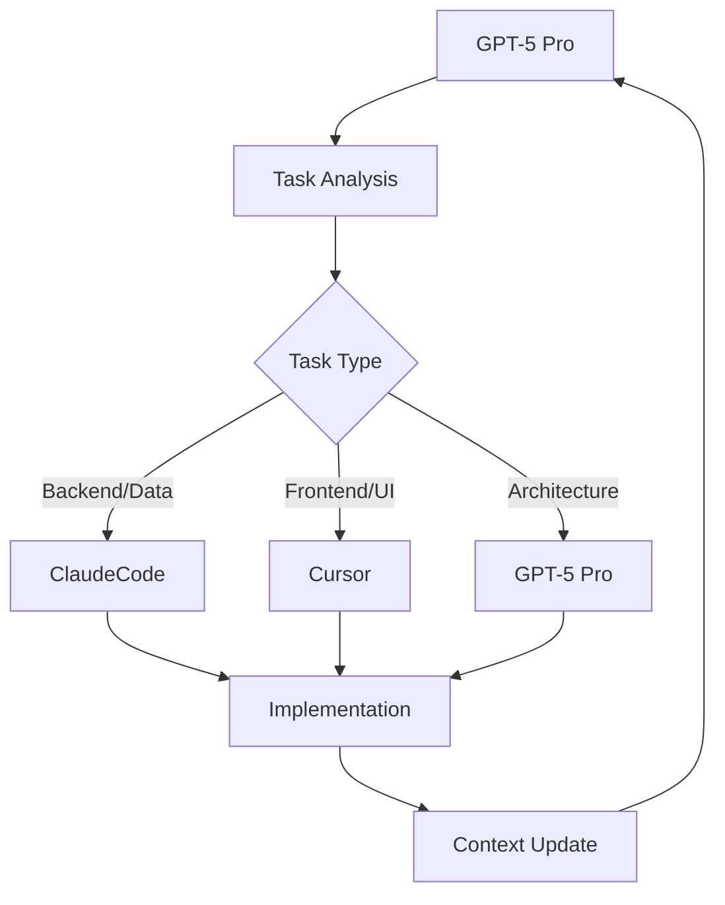

# 🔄 Cursor Triangular Integration Guide

**GPT-5 Pro ↔ ClaudeCode ↔ Cursor 삼각편대 시스템**

## 🎯 Overview

Cursor가 GPT-5 Pro와 ClaudeCode와 함께 효율적으로 협업할 수 있도록 설계된 삼각편대 워크플로우 시스템입니다.

### Role Distribution
- **GPT-5 Pro (HEAD)**: 전략적 의사결정, 아키텍처 설계, 전체 조율
- **ClaudeCode (main)**: 백엔드 서비스, 데이터 처리, 인프라 관리
- **Cursor (sub)**: 프론트엔드 개발, UI 컴포넌트, 사용자 경험

---

## 🚀 Quick Start Guide

### 1. 초기 설정 (한 번만 실행)

```bash
# 권한 설정
chmod +x scripts/generate_cursor_context.sh
chmod +x .git/hooks/post-commit
chmod +x .git/hooks/post-commit-cursor

# 초기 컨텍스트 생성
./scripts/generate_cursor_context.sh --include-files > CURSOR_CONTEXT.md
```

### 2. 일상적인 워크플로우

#### A. 새로운 작업 시작 시

```bash
# 1. 최신 컨텍스트 생성
./scripts/generate_cursor_context.sh --include-files --include-diff

# 2. 위 결과를 새 GPT-5 채팅에 복사 후 다음 메시지 추가:
# "Use this Cursor context for triangular collaboration with ClaudeCode"

# 3. 개발 서버 시작
npm run dev                    # Next.js (포트 3000)
node simple-web-server.js      # 인제스터 UI (포트 8080)
```

#### B. 작업 중 컨텍스트 공유

```bash
# 커밋 후 자동으로 CURSOR_CONTEXT.md 업데이트됨
git add .
git commit -m "feat: implement new feature"

# GPT-5에게 업데이트 알림
echo "Context updated! Check CURSOR_CONTEXT.md for latest changes"
```

#### C. GitHub Actions 기반 자동 컨텍스트

```bash
# PR 생성 시 자동으로 삼각편대 컨텍스트 댓글 생성
git push origin feature-branch
# → GitHub에서 PR 생성
# → Actions가 자동으로 컨텍스트 댓글 추가
# → 댓글 링크를 GPT-5에 공유
```

---

## 🖥️ Development Environment

### Port Management
- **3000**: Next.js 개발 서버 (메인 UI)
- **8080**: Simple web server (인제스터 UI)

### Health Checks
```bash
# 서버 상태 확인
curl http://localhost:3000/api/health
curl http://localhost:8080/api/health

# 포트 사용 상태 확인
lsof -ti:3000
lsof -ti:8080

# 포트 해제 (필요시)
lsof -ti:3000 | xargs kill -9
lsof -ti:8080 | xargs kill -9
```

### Key Features Testing
```bash
# Instagram 메타데이터 추출 테스트
curl -X POST http://localhost:3000/api/instagram/metadata \
  -H "Content-Type: application/json" \
  -d '{"url": "https://www.instagram.com/reel/example"}'

# TikTok 메타데이터 추출 테스트  
curl -X POST http://localhost:3000/api/tiktok/metadata \
  -H "Content-Type: application/json" \
  -d '{"url": "https://www.tiktok.com/@user/video/123"}'
```

---

## 📁 Project Structure (Cursor Focus)

```
src/
├── app/
│   ├── api/                           # API 엔드포인트
│   │   ├── instagram/
│   │   │   ├── metadata/route.ts      # Instagram 메타데이터 추출
│   │   │   └── download/route.ts      # Instagram 비디오 다운로드
│   │   ├── tiktok/
│   │   │   ├── metadata/route.ts      # TikTok 메타데이터 추출
│   │   │   └── download/route.ts      # TikTok 비디오 다운로드
│   │   └── normalize-url/route.ts     # URL 정규화
│   ├── instagram-extractor/           # 메타데이터 추출기 UI
│   │   └── page.tsx                   # 메인 UI 컴포넌트
│   └── globals.css                    # 전역 스타일
├── components/
│   ├── ui/                           # shadcn-ui 컴포넌트
│   │   ├── button.tsx
│   │   ├── input.tsx
│   │   ├── card.tsx
│   │   └── tabs.tsx
│   └── curator/                      # 큐레이션 관련 컴포넌트
├── lib/
│   ├── schemas/                      # Zod 스키마 정의
│   └── instagram-comment-extractor.js # Puppeteer 댓글 추출기
└── hooks/
    └── use-toast.ts                  # Toast 훅

Root Files:
├── simple-web-server.js              # 인제스터 UI 서버
├── package.json                      # 의존성 관리
└── INSTAGRAM_TIKTOK_METADATA_EXTRACTOR.md
```

---

## 🔄 Communication Patterns

### 1. Context Sharing Protocol

#### For GPT-5 Pro:
```markdown
# 새 채팅 시작 시
1. CURSOR_CONTEXT.md 전체 내용 복사
2. "Use this Cursor context for triangular collaboration with ClaudeCode" 추가
3. 현재 작업 목표 명시
```

#### For ClaudeCode:
```bash
# 컨텍스트 동기화
scripts/generate_summary.sh | tee /tmp/ctx.txt
# GPT-5에게 "/tmp/ctx.txt 내용과 함께 작업 진행" 메시지
```

#### For Cursor:
```bash
# 현재 상태 공유
./scripts/generate_cursor_context.sh --include-files
# 결과를 GPT-5 채팅에 업데이트
```

### 2. Task Assignment Flow



### 3. Progress Reporting

#### Cursor → GPT-5:
```bash
# 작업 완료 후
git add .
git commit -m "feat: implement Instagram extractor UI"
./scripts/generate_cursor_context.sh --include-diff
# 결과를 GPT-5에 공유
```

#### GPT-5 → ClaudeCode:
```markdown
Cursor has completed the Instagram extractor UI. 
Please review the implementation and integrate with backend services.
Context: [CURSOR_CONTEXT.md 링크]
```

---

## 🛠️ Advanced Features

### 1. Automated Context Generation

#### GitHub Actions Integration:
- PR 생성 시 자동으로 삼각편대 컨텍스트 댓글 생성
- 커밋 시 자동으로 컨텍스트 파일 업데이트
- Discussion에 자동 게시 (선택사항)

#### Local Automation:
```bash
# .git/hooks/post-commit에서 자동 실행
# 매 커밋마다 CURSOR_CONTEXT.md 자동 갱신
```

### 2. Context Filtering

```bash
# 기본 컨텍스트
./scripts/generate_cursor_context.sh

# 파일 목록 포함
./scripts/generate_cursor_context.sh --include-files

# 변경사항 포함
./scripts/generate_cursor_context.sh --include-diff

# 파일로 저장
./scripts/generate_cursor_context.sh --output cursor_context_$(date +%Y%m%d).md
```

### 3. Multi-Agent Coordination

#### Parallel Development:
```bash
# Cursor: UI 개발
npm run dev
# 동시에 ClaudeCode: 백엔드 서비스 개발
# GPT-5: 전체 조율 및 아키텍처 검토
```

#### Sequential Integration:
```bash
# 1. Cursor: 프론트엔드 완성
# 2. ClaudeCode: API 엔드포인트 구현
# 3. GPT-5: 통합 테스트 및 최적화
```

---

## 📊 Monitoring & Analytics

### Development Metrics:
```bash
# 커밋 빈도 분석
git log --oneline --since="1 week ago" | wc -l

# 변경 파일 통계
git diff --stat HEAD~10 HEAD

# 브랜치 상태
git status --porcelain
```

### Performance Monitoring:
```bash
# 서버 응답 시간
curl -w "@curl-format.txt" -o /dev/null -s http://localhost:3000/api/health

# 빌드 시간 측정
time npm run build
```

---

## 🚨 Troubleshooting

### Common Issues:

#### 1. Port Conflicts
```bash
# 문제: Port already in use
# 해결:
lsof -ti:3000 | xargs kill -9
lsof -ti:8080 | xargs kill -9
```

#### 2. Context Generation Fails
```bash
# 문제: Permission denied
# 해결:
chmod +x scripts/generate_cursor_context.sh
chmod +x .git/hooks/post-commit
```

#### 3. Instagram Extractor Not Working
```bash
# 문제: Page not loading
# 해결:
# 1. 파일 존재 확인
ls -la src/app/instagram-extractor/page.tsx

# 2. 개발 서버 재시작
npm run dev
```

#### 4. API Endpoints Failing
```bash
# 문제: API 500 errors
# 해결:
# 1. 로그 확인
npm run dev | grep ERROR

# 2. 의존성 재설치
npm install

# 3. 캐시 정리
rm -rf .next
npm run dev
```

### Emergency Recovery:

#### 1. Complete Reset:
```bash
# 모든 서버 중지
lsof -ti:3000,8080 | xargs kill -9

# 의존성 재설치
rm -rf node_modules package-lock.json
npm install

# 컨텍스트 재생성
./scripts/generate_cursor_context.sh --include-files > CURSOR_CONTEXT.md

# 서버 재시작
npm run dev &
node simple-web-server.js &
```

#### 2. Context Sync Recovery:
```bash
# Git 상태 정리
git add .
git stash

# 컨텍스트 강제 재생성
./scripts/generate_cursor_context.sh --include-files --include-diff > CURSOR_CONTEXT.md

# GPT-5에 재동기화 요청
echo "Emergency context resync required. Please use updated CURSOR_CONTEXT.md"
```

---

## 🔗 Quick Reference Links

### Documentation:
- [Main Workflow Guide](./GPT5_CLAUDECODE_CURSOR_TRIANGULAR_WORKFLOW.md)
- [Instagram/TikTok Extractor](../INSTAGRAM_TIKTOK_METADATA_EXTRACTOR.md)
- [Context System Guide](./CONTEXT_SYSTEM_GUIDE.md)

### Development URLs:
- **Next.js App**: http://localhost:3000
- **Ingester UI**: http://localhost:8080  
- **Instagram Extractor**: http://localhost:3000/instagram-extractor
- **API Health**: http://localhost:3000/api/health

### GitHub Integration:
- **Actions**: https://github.com/[repo]/actions
- **Pull Requests**: https://github.com/[repo]/pulls
- **Discussions**: https://github.com/[repo]/discussions

---

## 📝 Best Practices

### 1. Commit Messages:
```bash
# 좋은 예시
git commit -m "feat: add Instagram comment extraction with Puppeteer"
git commit -m "fix: resolve port conflict in development servers"
git commit -m "docs: update triangular workflow integration guide"

# 피해야 할 예시
git commit -m "update"
git commit -m "fix bug"
git commit -m "wip"
```

### 2. Context Sharing:
```bash
# 작업 시작 전
./scripts/generate_cursor_context.sh --include-files

# 중요한 변경 후
./scripts/generate_cursor_context.sh --include-diff

# 작업 완료 시
git commit -m "feat: complete feature implementation"
# → 자동으로 컨텍스트 업데이트됨
```

### 3. Communication:
```markdown
# GPT-5에게 명확한 상태 전달
Current Status: Instagram extractor UI completed
Next Steps: Need backend API integration
Context: See CURSOR_CONTEXT.md for implementation details
```

---

**🎯 이제 Cursor가 GPT-5 Pro ↔ ClaudeCode와 완벽하게 협업할 수 있는 삼각편대 시스템이 구축되었습니다!**
